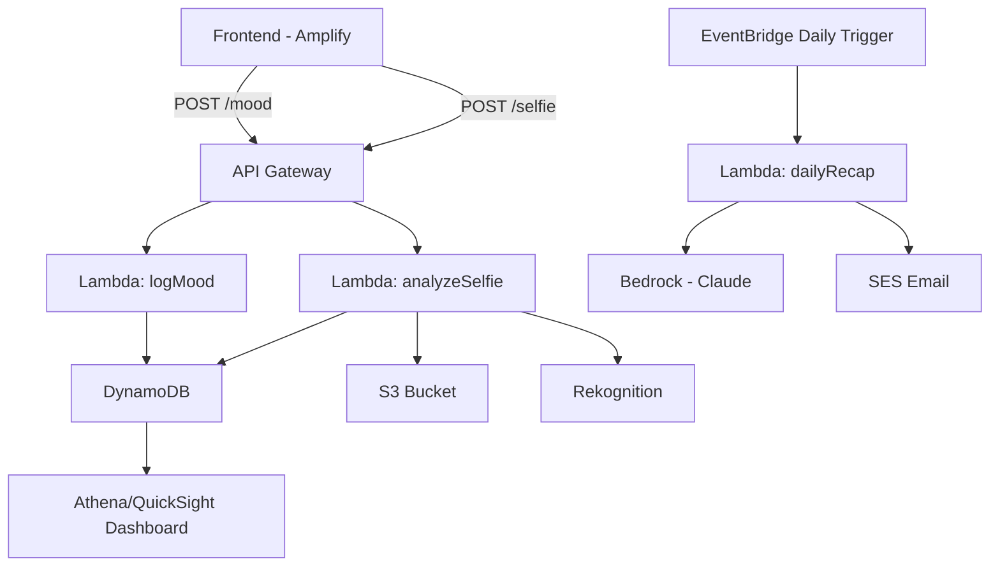

# 🐾 Mind Mate — AI Pet for Mental Wellness
> “Your AI pet companion that listens, learns, and helps you care for your mind.”

---

## 🌟 Overview
**Mind Mate** (formerly EmoCompanion) is an AWS-powered mental-health agent that blends emotional tracking, image understanding, and empathetic conversation into a single, privacy-aware companion.

Users interact daily with their **AI pet avatar**, logging moods, uploading selfies or surrounding photos, and receiving personalized coping strategies.  
Each day, Mind Mate sends a **mood-recap email** summarizing emotional trends and suggesting mindful activities — helping users stay aware, supported, and motivated.

Beyond reflection, Mind Mate’s ultimate goal is **early prediction and prevention** of mental distress.  
By continuously analyzing mood trends, sentiment, and behavioral patterns, the agent can surface **early warning signs of burnout, anxiety, or depression** and proactively suggest interventions before a breakdown occurs.
- **Early detection** of mental fatigue or burnout using trend analytics.  
- **Prevention** through timely suggestions and habit reinforcement.  
- **Personalization** via adaptive responses that evolve with user history.  
- **Education** by teaching self-awareness and evidence-based coping tools.  


---

## 💡 Inspiration
Mental health apps often feel clinical or impersonal. We wanted to design a **friendly, gamified companion** that makes emotional wellbeing engaging.  
Inspired by virtual pets and AI agents, EmoCompanion turns emotional self-care into a warm daily ritual — pairing empathy with AWS’s power in AI and data orchestration.

---

## 🎯 What It Does
- 🧠 **Mood Tracking** — Users record their daily mood, tags, and notes.
- 🤳 **Emotion & Context Analysis** — Amazon Rekognition detects facial expressions and scene context from selfies or surroundings (e.g., “park,” “office”).
- 🐕 **Pet Avatar Creation** — Amazon Titan Image G1 generates a custom pet avatar based on user description or uploaded photo.
- 💌 **Daily Recaps** — Bedrock (Claude/Nova) drafts empathetic daily summaries and coping suggestions, sent automatically through SES.
- 📈 **Insights Dashboard** — QuickSight visualizes weekly mood trends and top emotional states.
- 🔐 **Privacy & Safety** — Only derived scores (no facial data) are stored; Bedrock Guardrails enforce safety and PII masking.

---

## 🧠 Impact
By predicting risk patterns before crisis points, Mind Mate aims to **reduce mental-health deterioration** through continuous, compassionate micro-interventions — transforming passive mood logging into **active emotional prevention**.

## 🧱 Architecture

### Core AWS Components
| Layer | AWS Service | Purpose |
|-------|--------------|----------|
| **Frontend** | Amplify Hosting | Static web app (HTML/React) for mood check-ins |
| **Auth (optional)** | Amazon Cognito | Secure sign-in for users |
| **API Layer** | API Gateway (HTTP API) | Low-cost endpoint routing |
| **Compute** | AWS Lambda | Core “tools” for logging, analysis, recap generation |
| **Database** | DynamoDB | Store user moods, emotions, avatar metadata |
| **Storage** | Amazon S3 | Store images and assets |
| **AI Models** | Amazon Bedrock | Text agent (Claude/Nova), Image gen (Titan Image G1) |
| **Vision** | Amazon Rekognition | Face emotion and scene detection |
| **Messaging** | Amazon SES / EventBridge | Daily recap scheduling and delivery |
| **Analytics** | Athena + QuickSight | Mood-trend dashboards |
| **Security** | KMS, GuardDuty, IAM, Bedrock Guardrails | Data protection and compliance |

### Logical Flow



---

## 🧩 Lambda Functions (“Agent Tools”)

| Lambda | Purpose | Key APIs |
|---------|----------|----------|
| `logMood` | Stores daily mood, tags, notes | DynamoDB |
| `analyzeSelfie` | Analyzes selfie → detects emotions, stores top 3 | S3, Rekognition |
| `analyzeScene` | (optional) Detects surroundings | Rekognition |
| `generateAvatar` | Creates or stylizes user’s AI pet avatar | Bedrock Titan Image G1 |
| `dailyRecap` | Generates and emails daily recap with strategies | Bedrock Claude/Nova, SES |
| `getSummary` | Returns last 7-day summary for dashboard | DynamoDB/Athena |

---

---

## 🧩 Predictive & Preventive Layer
1. **Trend Analysis:**  
   - Each mood entry is timestamped and aggregated in DynamoDB.  
   - Athena queries 7-day moving averages and sentiment slopes.
2. **Trigger Rules:**  
   - If average mood ≤ 4 for 3 days or continuous negative sentiment detected → Lambda triggers an **early-warning event**.
3. **Preventive Action:**  
   - Bedrock composes an empathetic message with coping strategies and professional-help resources.  
   - Optionally notifies a trusted contact (opt-in) via SES or SMS.
4. **Dashboard Visualization:**  
   - QuickSight heatmaps show high-risk streaks and recovery trends.

## 📜 Bedrock Agent Prompt Examples

### **1️⃣ Daily Recap Prompt**

```
You are EmoCompanion, a supportive AI pet. 
Given the user’s last 24 hours of mood entries, detected emotions, and scene tags, 
compose a short empathetic message (max 150 words) that:
- Reflects their emotional trend kindly
- Acknowledges main stressors
- Suggests 2 evidence-based coping strategies (short & practical)
Avoid medical advice; keep tone warm and encouraging.
```

### **2️⃣ Coping Strategy Prompt**
```
Generate one positive activity or micro-habit based on current mood 
and surroundings. If the user is stressed and the scene includes 'office', 
suggest a short desk stretch or breathing break.
```

---

## 🗄️ Data Model (DynamoDB)

| PK | SK | Type | Fields |
|----|----|------|--------|
| `USER#<userId>` | `PROFILE` | Profile | petAvatarUrl, preferences |
| `USER#<userId>` | `MOOD#<timestamp>` | Mood log | mood (1-10), tags, notes |
| `USER#<userId>` | `SELFIE#<timestamp>` | Emotion record | s3Key, emotions[] |
| `USER#<userId>` | `SCENE#<timestamp>` | Context record | labels[] |
| `USER#<userId>` | `RECAP#<date>` | Daily recap | text, suggestions, sentAt |

---

## 🔐 Privacy & Governance
- Only **derived emotion scores** and **scene labels** are stored — no raw face embeddings.  
- All S3 objects are encrypted with **AWS KMS**.  
- **Bedrock Guardrails** prevent unsafe outputs and filter PII.  
- SES messages are opt-in; users can delete all data anytime.

---

## 🚀 Deployment Steps (summary)

1. **Enable models in Bedrock** (Claude/Nova, Titan Image G1).  
2. **Create resources** via AWS Console or CDK:  
   - DynamoDB table `EmoCompanion`  
   - S3 bucket `emocomp-uploads`  
   - Lambda functions + `EmoCompanionLambdaRole`  
   - API Gateway routes `/mood`, `/selfie`  
   - EventBridge daily rule → `dailyRecap`  
3. **Verify SES emails** (sender + recipient).  
4. **Deploy frontend** on Amplify Hosting using provided HTML/React app.  
5. **(Optional)** Connect Athena → QuickSight for analytics.

---

## 💰 Cost Control
- Serverless architecture keeps compute near-zero when idle.  
- Rekognition limited to ≤2 images/day/user.  
- Bedrock prompts short (<200 tokens).  
- SES email ≈ $0.001 per recap.  
- Estimated total under **$10/month** with light demo usage.

---

## 🧠 Lessons Learned
- Combining **text + image AI** on AWS is surprisingly seamless.  
- Rekognition emotion data adds contextual depth to LLM-generated empathy.  
- **Guardrails** and **PII filtering** are critical for responsible AI.  
- Serverless pipelines make complex agents feasible within a hackathon budget.

---

## 🚧 Challenges
- Fine-tuning prompt tone to sound supportive but non-clinical.  
- Managing Rekognition cost and image privacy.  
- Balancing “pet” personality with accurate emotional analytics.  
- Coordinating daily recap workflow (EventBridge + SES timing).

---

## 🔮 Next Steps
- Add **Cognito sign-in** and multi-user support.  
- Build **mobile app** front-end (Flutter or Amplify Studio).  
- Integrate **voice mood logging** with Amazon Transcribe.  
- Add **community + streak tracking** for habit reinforcement.  
- Explore **multi-agent orchestration** for deeper personalization.

---

## 🛠️ Built With
- **Languages:** Python, JavaScript  
- **Frontend:** HTML/React on AWS Amplify  
- **Backend:** AWS Lambda, API Gateway, DynamoDB, EventBridge  
- **AI/ML:** Amazon Bedrock (Claude, Titan), Bedrock Guardrails  
- **Vision:** Amazon Rekognition  
- **Messaging:** Amazon SES  
- **Analytics:** Athena, QuickSight  
- **Storage:** S3, KMS encryption  
- **Auth (optional):** Amazon Cognito  

---

## 🔗 Try It Out
- **Demo:** _[Amplify App URL]_  
- **Repo:** _[GitHub URL]_  
- **Video Walkthrough:** _[YouTube/Loom link]_  

---

© 2025 EmoCompanion. Built for the AWS AI Agent Hackathon.
